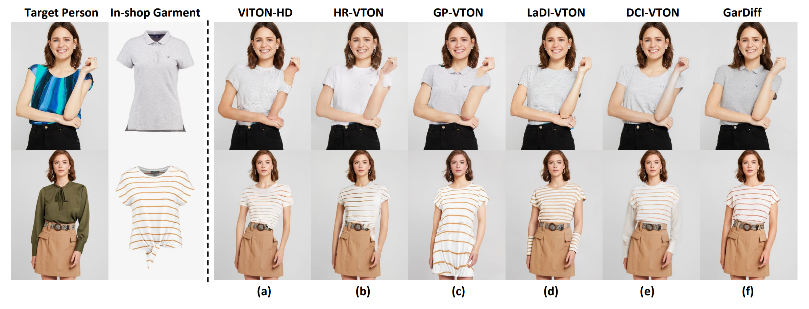

<h1>Improving Virtual Try-On with Garment-focused Diffusion Models</h1>
<div>
    <a>Siqi Wan</a><sup>1</sup>,
    <a>Yehao Li</a><sup>2</sup>,
    <a>Jingwen Chen</a><sup>2</sup>,
    <a>Yingwei Pan</a><sup>2</sup>,
    <a>Ting Yao</a><sup>2</sup>,
    <a>Yang Cao</a><sup>1</sup>
    <a>Tao Mei</a><sup>2</sup>
</div>
<div>
    <sup>1</sup>University of Science and Technology of China; <sup>2</sup>HiDream.ai Inc
</div>
</br>

This is the official repository for the 
[Paper](https://arxiv.org/pdf/2303.13756.pdf) 
"Improving Virtual Try-On with Garment-focused Diffusion Models"

## Overview


> **Abstract**: <br>
> Diffusion models have led to the revolutionizing of generative modeling in numerous image synthesis tasks. Nevertheless, it is not trivial to directly apply diffusion models for synthesizing an image of a target person wearing a given in-shop garment, i.e., image-based virtual try-on (VTON) task. The difficulty originates from the aspect that the diffusion process should not only produce holistically high-fidelity photorealistic image of the target person, but also locally preserve every appearance and texture detail of the given garment. To address this, we shape a new Diffusion model, namely GarDiff, which triggers the garment-focused diffusion process with amplified guidance of both basic visual appearance and detailed textures (i.e., high-frequency details) derived from the given garment. GarDiff first remoulds a pre-trained latent diffusion model with additional appearance priors derived from the CLIP and VAE encodings of the reference garment. Meanwhile, a novel garment-focused adapter is integrated into the UNet of diffusion model, pursuing local fine-grained alignment with the visual appearance of reference garment and human pose. We specifically design an appearance loss over the synthesized garment to enhance the crucial, high-frequency details. Extensive experiments on VITON-HD and DressCode datasets demonstrate the superiority of our GarDiff when compared to state-of-the-art VTON approaches. 
## Installation
Create a conda environment and install dependencies:
```
pip install -r requirements.txt
```
## Dataset
You can download the VITON-HD dataset from [here](https://github.com/xiezhy6/GP-VTON) <br>
For inference, the following dataset structure is required: <br>
```
test
|-- image
|-- masked_vton_img 
|-- warp-cloth
|-- cloth
|-- cloth_mask
```
## Inference
Please download the pre-trained model from [Google Link](https://drive.google.com/drive/folders/1rXnxHwG-OrDtm-c58OuhYj0m4dwGaYYE?usp=drive_link)
```
sh inf_gar.sh
```
## Acknowledgement
Thanks the contribution of [LaDI-VTON](https://github.com/miccunifi/ladi-vton) and [GP-VTON](https://github.com/xiezhy6/GP-VTON).

## Citation

If you make use of our work, please cite our paper:

```bibtex
@inproceedings{wan2025improving,
  title={Improving Virtual Try-On with Garment-focused Diffusion Models},
  author={Wan, Siqi and Li, Yehao and Chen, Jingwen and Pan, Yingwei and Yao, Ting and Cao, Yang and Mei, Tao},
  booktitle={ECCV},
  year={2025},
}
```
